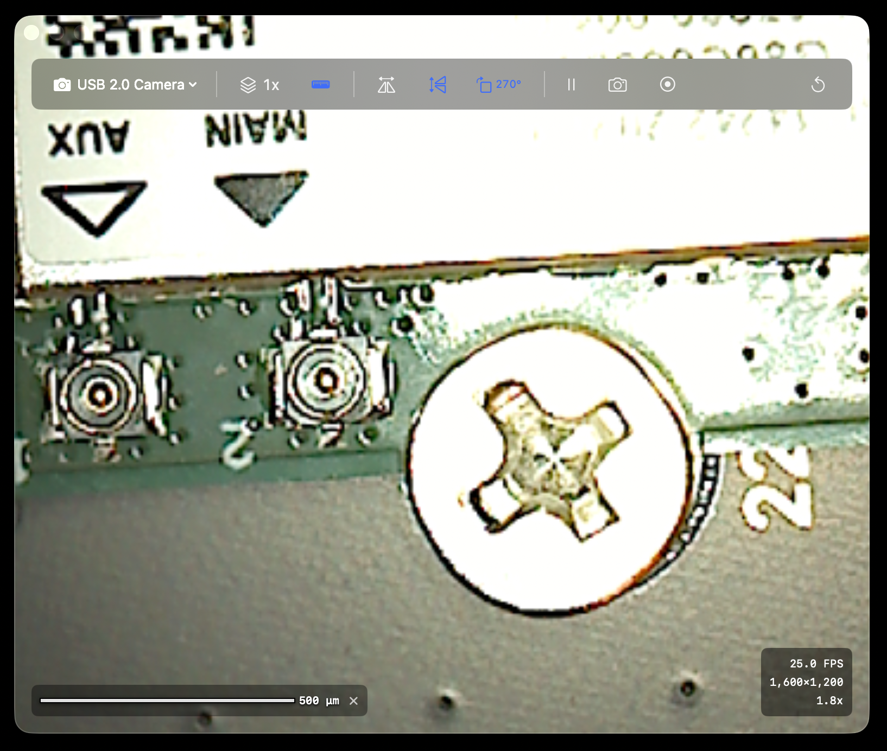

# SolderScope

A native macOS application for USB microscope viewing, optimized for soldering and electronics inspection.

## Overview

SolderScope provides a low-latency live view with smooth zoom/pan controls, scale bar overlays with one-time calibration, and essential capture features—all designed for bench work with USB microscopes.



## Features

### Core Features
- **Live View** — Low-latency video feed from USB microscopes
- **Zoom/Pan** — Scroll wheel zoom (around cursor), click-drag pan, double-click reset
- **Scale Bar** — Calibrated overlay showing real-world measurements
- **Frame Integration** — Average 1-16 frames for noise reduction on static scenes

### Capture Features
- **Freeze Frame** — Pause live view for inspection
- **Snapshots** — Save current view as PNG with optional overlays
- **Video Recording** — Record sessions with H.264/HEVC encoding

### Quality of Life
- **Auto Camera Selection** — Remembers your microscope
- **Per-Resolution Calibration** — Calibration stored per camera and resolution
- **Keyboard Shortcuts** — Full keyboard control for bench use

## Keyboard Shortcuts

| Key | Action |
|-----|--------|
| `Space` | Freeze/unfreeze frame |
| `S` | Take snapshot |
| `R` | Toggle recording |
| `I` | Cycle integration (1→2→4→8→16→1) |
| `B` | Toggle scale bar |
| `0` | Reset zoom/pan |
| `Esc` | Cancel calibration/measurement mode |

## Calibration

SolderScope supports one-time calibration for accurate scale bars:

1. Enable scale bar (`B` key)
2. If uncalibrated, enter calibration mode
3. Draw a line across a known distance (e.g., 0402 component = 1.0mm, header pitch = 2.54mm)
4. Enter the known length
5. Calibration is saved per camera and resolution

## Requirements

- macOS 13.0+ (Ventura or later)
- USB microscope (UVC-compatible)
- Camera access permission

## Building

```bash
# Clone the repository
git clone https://github.com/yourusername/SolderScope.git
cd SolderScope

# Open in Xcode
open SolderScope.xcodeproj

# Build and run (Cmd+R)
```

## Architecture

```
SolderScope/
├── App/
│   ├── SolderScopeApp.swift      # App entry point
│   └── ContentView.swift          # Main window layout
├── Capture/
│   ├── CaptureManager.swift       # AVCaptureSession management
│   ├── CameraDevice.swift         # Camera enumeration/selection
│   └── FrameProcessor.swift       # Frame pipeline (integration, filters)
├── Renderer/
│   ├── MicroscopeView.swift       # Main rendering view
│   ├── ViewTransform.swift        # Zoom/pan transform state
│   └── OverlayRenderer.swift      # Scale bar, HUD, annotations
├── Calibration/
│   ├── CalibrationManager.swift   # Calibration storage/retrieval
│   ├── CalibrationView.swift      # Calibration wizard UI
│   └── ScaleBarCalculator.swift   # Scale bar sizing logic
├── Recording/
│   ├── RecordingManager.swift     # AVAssetWriter pipeline
│   └── SnapshotManager.swift      # PNG/TIFF export
├── Persistence/
│   └── SettingsStore.swift        # UserDefaults wrapper
└── Utilities/
    ├── CoordinateTransform.swift  # Image ↔ View coordinate mapping
    └── Constants.swift            # App-wide constants
```

### Coordinate Spaces

- **Image Space:** Pixel coordinates in captured frame (origin top-left)
- **View Space:** Points in the window
- Transform `T` maps image → view (scale + translation + letterbox fit)
- Mouse interactions use `T⁻¹` to map view → image coordinates

### Calibration Data Model

```swift
struct Calibration: Codable {
    let cameraID: String        // Unique device identifier
    let width: Int              // Frame width
    let height: Int             // Frame height
    let micronsPerPixel: Double // Calibration value
}
```

## Non-Goals (v1)

- Hardware automation (motorized stages, focus)
- Complex image processing (denoising, registration)
- Cross-platform support
- Audio recording

## Contributing

1. Check the [Issues](../../issues) for open tasks
2. Follow the milestone structure
3. Keep PRs focused on single features/fixes

## License

MIT License - See [LICENSE](LICENSE) for details
